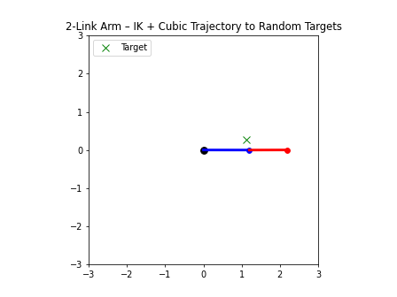
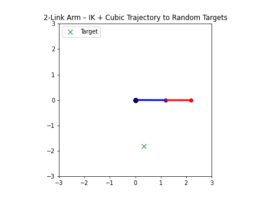

# 🚀 2-Link Robot Arm — Trajectory Planning with Inverse Kinematics (Cubic Interpolation)

This project extends my previous IK simulation (robot chasing random targets) by adding **trajectory planning** using **cubic polynomial interpolation**.

Instead of **jumping instantly** to new IK angles when a target changes, the robot now generates a **smooth joint-space trajectory** and **follows it over time** — just like a real industrial manipulator.

---

## 🎯 What this simulation demonstrates

| Concept | Meaning |
|--------|---------|
| Forward Kinematics (FK) | Joint angles → end effector position |
| Inverse Kinematics (IK) | Target position → required joint angles |
| Trajectory Planning | Smooth time-based path between two IK solutions |
| Cubic Interpolation | Zero-velocity start & end → no jerks |
| Online Target Tracking | Robot recomputes a new trajectory when target changes |

> In plain terms:  
> The arm **doesn’t teleport to the target** — it **travels smoothly** and **naturally** along a planned curve in joint space.

---

## 🔥 What’s new compared to Repo-4 (IK dynamic tracking)

| Repo | Behavior |
|------|----------|
| IK Tracking (Repo-4) | Robot updates IK → moves a little bit → updates → moves again |
| 🟢 This Repo (Trajectory Planning) | Robot computes a **complete path** first and **follows it smoothly** |

This version is **closer to real robotic arms** used in factories and humanoids.

---

## 🤖 Robot Model

A 2-link planar arm:

- (base) ── L1 ── (elbow) ── L2 ── (end effector)

- L1 = 1.2
- L2 = 1.0
- Joints = θ1, θ2 (rotational)

Targets are randomly sampled, but always **reachable**.

---

## ⚙️ Trajectory Planning (Cubic Polynomial)

The robot moves from current angle `θ_start` to target angle `θ_target` in a fixed time `T` using:

- θ(t) = a0 + a1·t + a2·t² + a3·t³

Constraints we enforce:

- θ(0) = θ_start
- θ(T) = θ_target
- dθ/dt at t=0 = 0 (start with zero velocity)
- dθ/dt at t=T = 0 (end with zero velocity)

That means:

✔ No jerk at beginning  
✔ No jerk at target arrival  
✔ Robot motion looks natural

---

## 🔄 Animation Logic

- Pick random reachable target
- Use IK → get θ1_target, θ2_target
- Build cubic trajectory for θ1 & θ2
- Follow trajectory until completion
- Hold briefly at the target
- Pick new target → repeat

So the arm **continuously and smoothly follows new targets**, without snapping or oscillating.

---

## 📸 Preview (GIF)

Below are the simulation results generated from this project.  
Make sure all GIFs are placed inside the `assets/` folder.

# Simulation Preview
- IK + Cubic Trajectory to Random Targets
- Segment-based Target Switching with Smooth Joint Motion
- Continuous IK-Driven Motion Tracking — No Jerks or Stops
- 




---

## 📂 Project Structure

trajectory-planning-2d-inverse-kinematics/
│

├── arm_math.py # FK & IK functions for 2-link arm

├── cubic_trajectory.py # Compute + evaluate cubic interpolation

├── sim_ik_cubic_random_targets.py# Main simulation + animation

└── README.md


---

## 🚀 Run the Simulation

Normal use (view animation only):

```bash
python sim_ik_cubic_random_targets.py
```
To export GIF for README:
- SAVE_GIF = True   # inside the script
After export, set it back to:
- SAVE_GIF = False

---

## 💡 Why this project matters in real robotics

This is the first step toward **full motion planning**.

| System | Uses |
|--------|------|
| Industrial robot arms | Pick & place, welding, assembly |
| Humanoid hands | Object handover, human–robot interaction |
| Manipulation planners | MoveIt, OMPL |
| Dynamic tracking systems | Camera → IK → smooth trajectory |

> **IK tells the robot _where_ the end effector should be.**  
> **Trajectory planning tells the robot _how to get there safely and smoothly_.**

Without trajectory planning:
- The robot jumps abruptly between IK solutions
- Hardware stress increases
- Movements become unstable and unsafe

With trajectory planning:
- Joint motion is time-parameterized
- Velocity and acceleration are controlled
- Movement becomes smooth, predictable, and safe — *just like industrial robots*

---

## 🏁 Takeaway

After completing this project, I now understand:

✔ IK gives *target joint angles* — but that alone is not enough  
✔ Real robots need *time-based motion planning*, not just reaching positions  
✔ *Cubic trajectories* prevent sudden jumps, velocity spikes, and hardware stress  
✔ *Smooth interpolation* is the foundation of all robotic manipulation systems  
    → without it, even perfect IK produces unsafe and unstable motion

This project marks the transition from **“reaching a point”** to  
**“reaching a point safely, smoothly, and realistically like an industrial robot.”**

---
